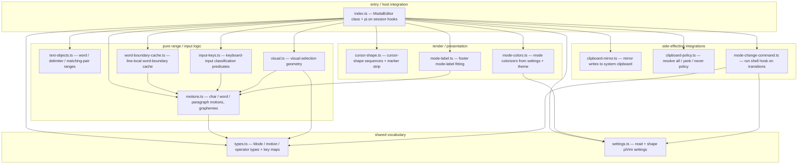
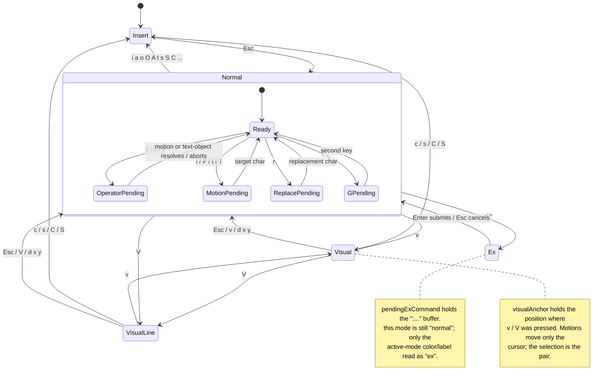
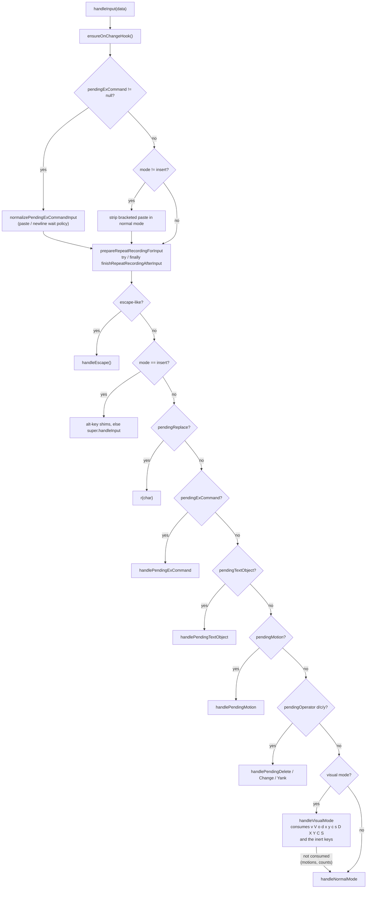
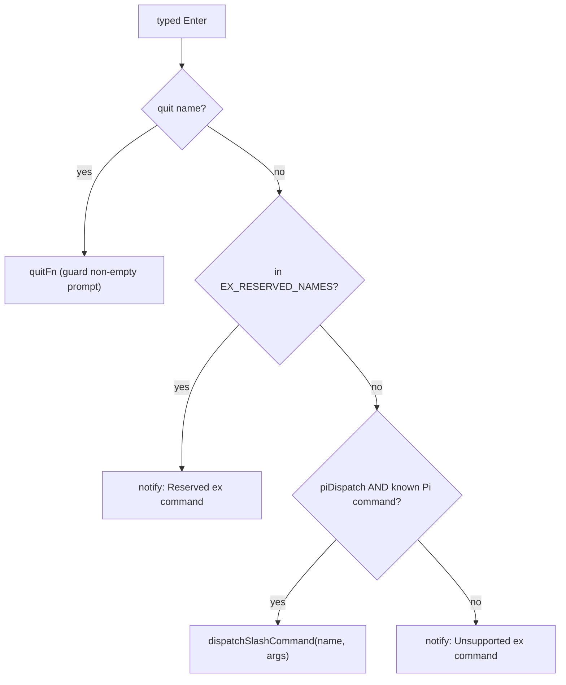

# architecture

How pi-vim is put together: the module/ownership map, the modal state
machine, and the input-dispatch pipeline. This is the high-level map for
review and onboarding; behavior details live in the `README.md` reference
and the per-behavior tests under `test/`.

pi-vim is one `ModalEditor` class (in `index.ts`) that subclasses Pi's
`CustomEditor`, plus a ring of small single-purpose modules it delegates
to. The class owns all mutable editor state and the key-dispatch loop; the
modules are either pure range/string logic, render helpers, or the
side-effecting host integrations (clipboard, mode-change shell hooks).

## module / ownership map

Every arrow is a direct `import`. The graph is acyclic and one-directional:
`index.ts` depends on everything; nothing depends on `index.ts`. `types.ts`
and `settings.ts` are the shared leaves. The `pure` and `render` modules
hold no editor state (`mode-label`, `input-keys`, `cursor-shape`,
`motions`, `text-objects` are free functions), which is what makes them
safe to unit-test in isolation and to move out of the class without
changing behavior.

| module | owns | pure? |
| --- | --- | --- |
| `index.ts` | modal state machine, key dispatch, operators, undo/redo, dot-repeat, visual selection anchor, put/register, render composition, EX mini-mode and the pi-command bridge, session hooks | no (all mutable state) |
| `types.ts` | `Mode`, `CharMotion`, `PendingMotion`, `PendingOperator`, `LastCharMotion`, `NORMAL_KEYS` | n/a (types + constants) |
| `settings.ts` | `PiVimSettings` shape + `readPiVimSettings` + the `exCommand` resolver | reads settings |
| `motions.ts` | char-find / word / paragraph motion targets, grapheme splitting | yes |
| `text-objects.ts` | word / delimited / matching-pair range resolution | yes |
| `word-boundary-cache.ts` | line-keyed cache of word-motion boundaries | stateful cache, no editor state |
| `input-keys.ts` | escape/enter/backspace/printable/digit/count classification of a raw input chunk | yes |
| `visual.ts` | anchor/cursor ordering, line-wise line range, grapheme-aware inclusive selection end, stale-anchor clamping | yes |
| `cursor-shape.ts` | cursor-shape escape sequences, software-cursor marker stripping | render helpers |
| `mode-label.ts` | grapheme-aware fitting of the footer mode label | yes |
| `mode-colors.ts` | resolve/build per-mode colorizers from settings + theme | resolves config |
| `mode-change-command.ts` | debounced shell command on mode transitions | side effect (spawn) |
| `clipboard-mirror.ts` | mirror register writes to the system clipboard via child process, with a failure circuit breaker | side effect (spawn) |
| `clipboard-policy.ts` | resolve the `all` / `yank` / `never` mirror policy | yes |

## modal state machine

`this.mode` is one of `"insert"`, `"normal"`, `"visual"`, or
`"visual-line"`. EX mini-mode is not a fifth `Mode`: it is
`this.mode === "normal"` with `pendingExCommand !== null`.
`getActiveMode()` reports `"ex"` for border/label coloring and folds both
visual modes onto `"normal"`, so EX entry/exit and visual entry/exit reuse
the normal-mode colors. Mode-change shell hooks *do* fire on visual
transitions (they receive `"visual"` / `"visual-line"` and run the
`modeChange.normal` command) but not on EX entry/exit. Within normal mode,
several short-lived *pending* sub-states capture the next key(s) of a
multi-key command.

Counts (`prefixCount`, `operatorCount`) accumulate alongside these pending
states and are consumed by `takeTotalCount()`, which combines a prefix count
and an operator count — multiplying when both are present — and clamps the
result to `MAX_COUNT`.

## input-dispatch pipeline

`handleInput(data)` is the single entry point for every keystroke. Two
pre-passes run before the main dispatch: EX input normalization (the paste
/ newline wait policy, which prevents a pasted line from auto-submitting)
and bracketed-paste stripping in normal mode. The main dispatch is then
wrapped in `prepareRepeatRecordingForInput` / `finishRepeatRecordingAfterInput`
(a `try` / `finally`) so dot-repeat records the keystrokes of the last
change regardless of which branch handles them. The branch order is a
strict precedence: pending state is always consumed before normal-mode keys,
which is why `f.`, `r.`, and `d.` take `.` as their argument rather than as
a repeat.

`handleVisualMode` returns a boolean rather than owning the whole key
space: motions and counts deliberately fall through to `handleNormalMode`,
so a visual selection resizes using exactly the same motion code paths as
normal mode. It also declines to consume anything while `pendingG` or
`pendingMotion` is set, which keeps `vgg` and `vfx` working.

### EX mini-mode dispatch

`:` in normal mode calls `startPendingExCommand()`, seeding the buffer with
`":"`. Subsequent keys append through `handlePendingExCommand` (with the
paste/newline wait policy applied in the pre-pass, so a pasted newline is
truncated away rather than submitting). `Esc` cancels; a **typed** `Enter` —
the only thing that can submit — calls `submitPendingExCommand()`, which
resolves the line in a fixed precedence order:

1. strip the leading `:`, trim, and detect a trailing `!` (force);
2. if the name is a reserved quit name (`q`, `qa`, `quit`, `qall`,
   `quitall`), quit — guarding a non-empty prompt unless forced;
3. split the remainder into `name` and verbatim `args` on the first
   whitespace run;
4. if `name` is in `EX_RESERVED_NAMES` (held for future vim ex semantics),
   surface a "Reserved ex command" notice — never dispatch;
5. if `piDispatch` is on and `name` is a known Pi command, dispatch it;
6. otherwise surface an "Unsupported ex command" notice.

### the pi-command bridge

Pi exposes no public command-dispatch API, so `dispatchSlashCommand` reuses
the one mechanism that reaches every command kind: the editor's own submit
path. `:name args` becomes `/name args` in the buffer, then `onSubmit` runs —
byte-for-byte what happens when the user types the slash command themselves.
Two seams keep that coupling injectable and testable without a live runtime:

| seam | default | supplied at `session_start` |
| --- | --- | --- |
| `setRunCommandFn` | `setText(line)` then `onSubmit(line)` | not overridden (the editor owns its submit) |
| `setCommandNamesFn` | the mirrored builtin names | union of builtins and `pi.getCommands()` |
| `setExCommandSettings` | dispatch on, clipboard copy off | `resolveExCommandSettings` |

`getCommands()` is called inside the thunk, so the known-command set is
recomputed on every submit and a command registered mid-session is reachable.
Pi's builtin list is not re-exported from the package entry point, so
`EX_BUILTIN_COMMAND_NAMES` mirrors it; a name missing from that mirror simply
falls through to "unsupported".

Every dispatch route clears the prompt buffer, and no command reads that buffer
as an argument. So `dispatchSlashCommand` brackets the call with the same
`captureSnapshot` / `restoreSnapshot` pair the dot-repeat rollback uses,
restoring text *and* cursor in a `finally`. Both of Pi's routes clear
synchronously before their first `await`, so the restore wins; a route that
cleared after an `await` would defeat it, which is what the opt-in
`copyInputToClipboard` setting exists to cover.

Restoring the text is not enough on its own. The dispatch's own `setText("")`
is a buffer mutation the user never typed, and it leaves three traces: an entry
on the host editor's undo stack, a cleared redo stack, and a cleared repeatable
command (both via the `setText` override). Left alone, the first `u` after any
`:command` would be silently swallowed undoing the dispatch's churn. So the
`finally` also pops the undo stack back to its pre-dispatch depth and restores
`redoStack` and `lastRepeatableCommand`. The invariant worth remembering: a
dispatch is transparent to the buffer, the cursor, undo, redo, and `.`.

## where the larger behaviors live in `index.ts`

- **undo / redo**: snapshot capture/restore + a `redoStack`; `performUndo`
  / `performRedo` around the host editor's own history.
- **dot-repeat**: a keystroke recorder (`repeatRecording`) captured by the
  dispatch wrap; `repeatLastCommand` replays the recorded key stream, with
  a snapshot rollback if a replay fails. The recorder is disabled in visual
  mode, and `applyVisualOperator` calls `clearRepeatState()` so a later `.`
  cannot replay a normal-mode command the user has moved past.
- **visual mode**: `visualAnchor` plus `this.mode`; `applyVisualOperator`
  resolves the selection through `visual.ts` and then reuses the existing
  `deleteRangeByAbsolute` / `yankRangeByAbsolute` / `deleteLineRange` /
  `yankLineRange` primitives, so `Vd` and `dd` share their cursor
  behaviour (and their known nvim divergence).
- **put / register**: `unnamedRegister` plus the clipboard-mirror policy;
  `putAfter` / `putBefore` handle char-wise vs line-wise placement.
- **render**: `render()` composes lines, fits the mode label
  (`mode-label.ts`), applies mode colorizers (`mode-colors.ts`), and syncs
  the cursor shape (`cursor-shape.ts`) — the cursor-shape write is the one
  side effect on the render path.

## testing model

- `npm test` runs `test/**/*.test.ts` on Node's built-in runner — unit
  tests over the pure modules and the class's observable behavior.
- `npm run test:nvim` runs the parity suites (`test/nvim-parity-*.ts`),
  which drive real headless nvim and compare text / cursor / mode /
  register, pinning pi-vim's behavior to the reference editor.
- `test/**` is excluded from the npm package, so tests never affect the
  `pack:check` size budget.
